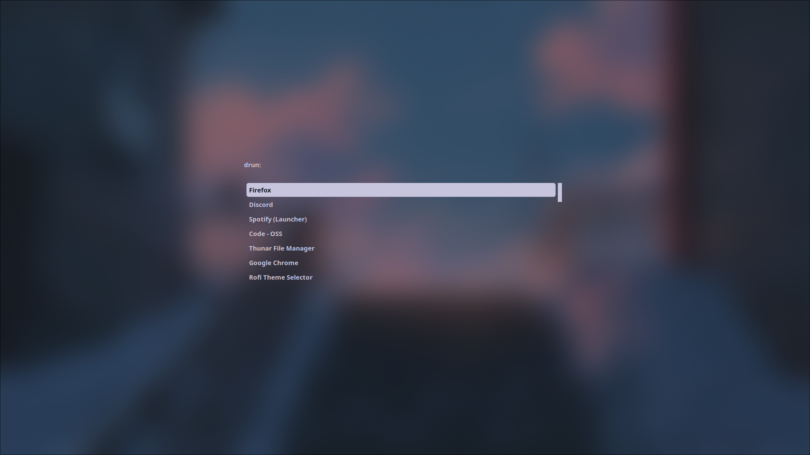
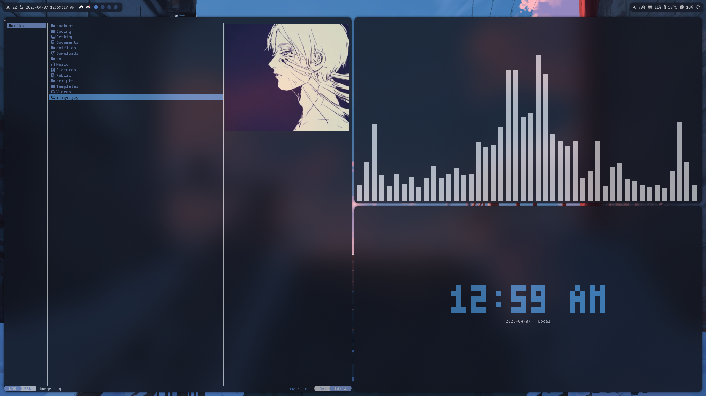

# dotfiles

Personal configuration files for my Arch setup.

## Screenshots







## Install

```bash
./install.sh
```

The installer backs up any existing config directories in `~/.config` and symlinks the repo folders into place.
