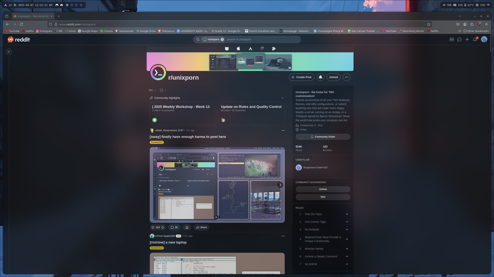
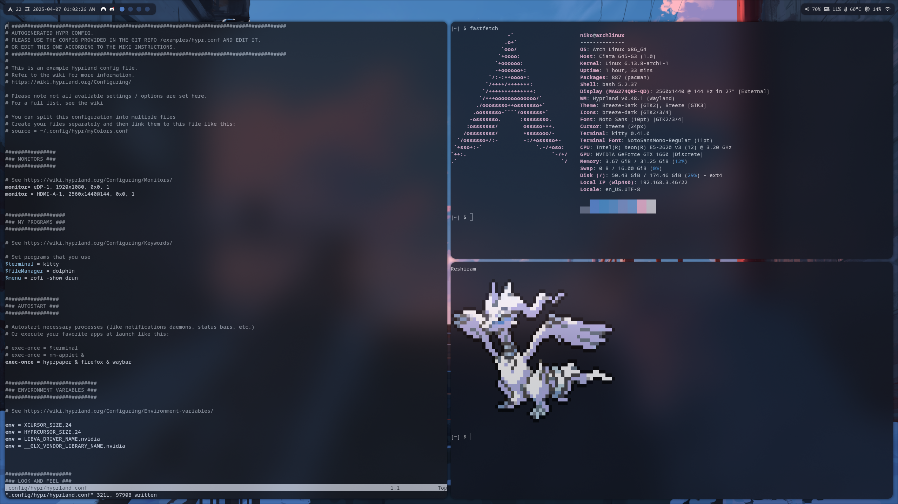

# dotfiles

Personal configuration files for my desktop setup.

## Screenshots

<table>
  <tr>
    <td></td>
    <td></td>
  </tr>
  <tr>
    <td></td>
    <td></td>
  </tr>
  <tr>
    <td colspan="2"></td>
  </tr>
</table>

## Install

```bash
./install.sh
```

The installer backs up any existing config directories in `~/.config` and symlinks the repo folders into place.
